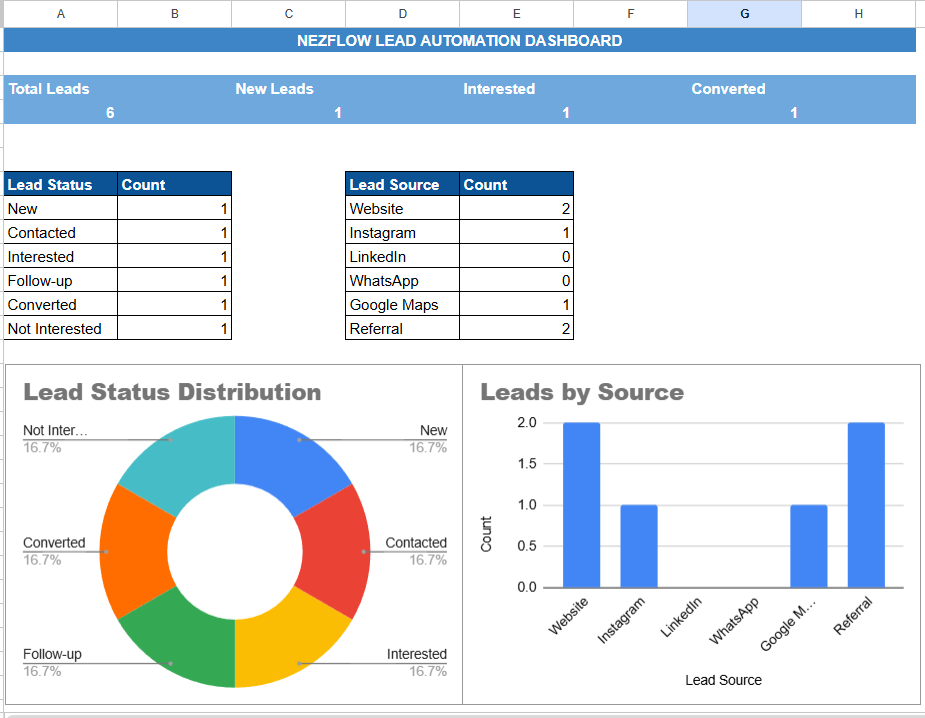
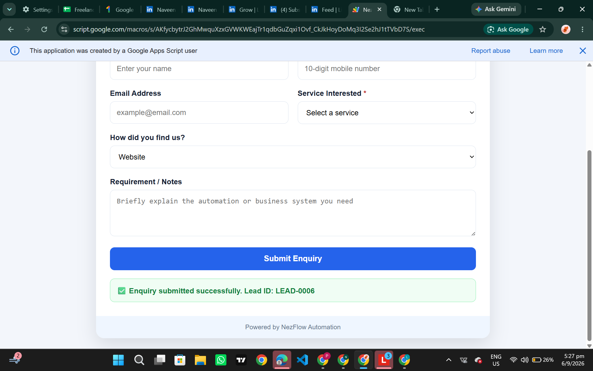
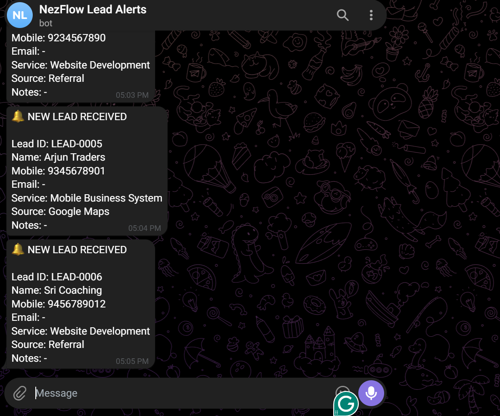

# Lead Capture and Telegram Alert Automation

A web-based lead capture system that automatically stores customer enquiries in Google Sheets and sends instant Telegram notifications through an API.

## Problem

Businesses can miss potential customers when enquiries are recorded manually or checked too late.

## Solution

This system captures lead details through a mobile-friendly web form, saves them in Google Sheets and immediately sends a Telegram alert.

## Features

* Mobile-friendly lead capture form
* Automatic Lead ID generation
* Date and time recording
* Google Sheets data storage
* Service, source and status dropdowns
* Follow-up tracking
* Dashboard KPIs and charts
* Instant Telegram bot alerts
* Secure credential storage using Script Properties

## Technology Used

* Google Sheets
* Google Apps Script
* HTML
* CSS
* JavaScript
* Telegram Bot API

## Workflow

1. Customer submits the web form.
2. Apps Script validates the information.
3. Lead details are stored in Google Sheets.
4. Dashboard values update automatically.
5. Telegram API sends an instant alert.

## Screenshots

### Lead Dashboard

### Web Lead Form

### Telegram API Alert

## Security

Bot tokens, Chat IDs and private deployment details are stored securely and are not included in this public repository.

## Project Status

Completed and successfully tested from web form submission to Telegram notification.
